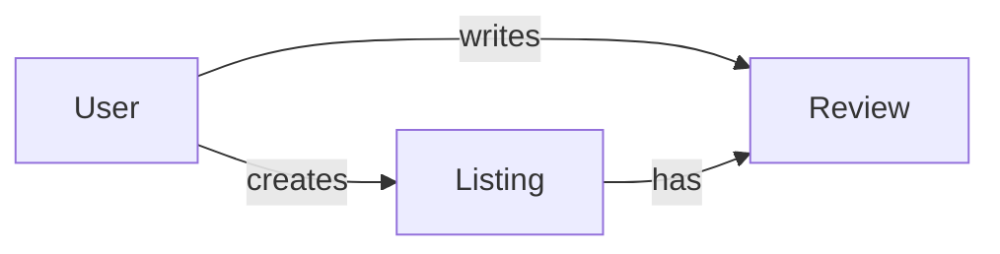

# StayHub (Airbnb Clone)

A full-stack rental platform engineered using the Model-View-Controller (MVC) architecture to manage property listing, discovery, and user interactions with secure workflows and scalable integrations.

---

## Overview

StayHub implements an end-to-end rental workflow that:

- Enables users to create and manage property listings  
- Supports location-based discovery using geospatial data  
- Handles media uploads and storage efficiently  
- Maintains secure authentication and session management  
- Provides structured request handling through RESTful APIs  

The system focuses on clean architecture, data modeling, and integration with external services.

---

## Key Contributions

- Architected a RESTful backend using MVC principles to separate routing, business logic, and data access layers  
- Implemented secure session-based authentication using Passport.js to protect user-specific operations  
- Designed MongoDB schemas for listings, users, and reviews using relational referencing  
- Integrated Cloudinary for scalable media storage and Mapbox for geospatial visualization  
- Optimized database interactions by reducing redundant queries and improving response efficiency  

---

## System Architecture

### MVC Design

- Routes handle request routing  
- Controllers encapsulate business logic  
- Models manage database interactions  
- Views render dynamic UI  

---

### Request Flow

```text
Client Request
   ↓
Express Router
   ↓
Authentication Middleware
   ↓
Validation Middleware (Joi)
   ↓
Controller Logic
   ↓
Mongoose Model
   ↓
MongoDB
   ↓
Response (View / JSON)
```
### Data Modeling

- Listings reference users and associated reviews  
- Reviews maintain relationships with both users and listings  

Ensures:

- Data consistency  
- Efficient querying  
- Scalable relationships  

---

### Data Relationships



### Media and Geospatial Integration

- Cloudinary handles image upload, storage, and optimized delivery  
- Implemented forward geocoding using Mapbox to convert user-input addresses into latitude and longitude coordinates  
- Enabled map-based discovery using geospatial data  

Ensures:

- Accurate location representation  
- Scalable media handling  
- Improved user experience  

---

### Authentication and Security

- Session-based authentication using Passport.js  
- Route protection via middleware  
- Input validation using Joi  
- Environment-based configuration for sensitive data  

---

### Middleware Strategy

- Centralized authentication middleware for protected routes  
- Joi-based validation middleware to enforce request schema consistency  
- Centralized error handling to reduce duplication  

Ensures:

- Separation of concerns  
- Maintainable codebase  
- Consistent request handling  

---

## Tech Stack

- Backend: Node.js, Express.js  
- Frontend: EJS, HTML, CSS, Bootstrap  
- Database: MongoDB (Mongoose)  
- Authentication: Passport.js  
- Storage: Cloudinary  
- Maps: Mapbox API  
- Validation: Joi  

---

## Project Structure

```bash
StayHub/
├── controllers/       # Business logic
├── models/            # Database schemas
├── routes/            # Request routing
├── views/             # UI templates
├── public/            # Static assets
├── utils/             # Helpers and validation
├── middleware.js      # Custom middleware
├── cloudConfig.js     # Cloudinary configuration
└── app.js             # Application entry point
```
## Performance Considerations

- Reduced redundant database queries to improve response time  
- Structured schema design for efficient data access  
- Asynchronous media handling via Cloudinary  
- Middleware-based request handling for clean execution flow  

---

## Limitations

- No booking or availability system  
- No advanced search or filtering  
- Monolithic architecture  

---

## Future Enhancements

- Booking and availability system  
- Advanced filtering and search  
- Wishlist functionality  
- Email-based authentication  
- Administrative dashboard  

---

## Summary

This project demonstrates a structured approach to building a full-stack application with emphasis on backend architecture, data modeling, and integration with external services. It reflects practical system design considerations relevant to production-grade web applications.
